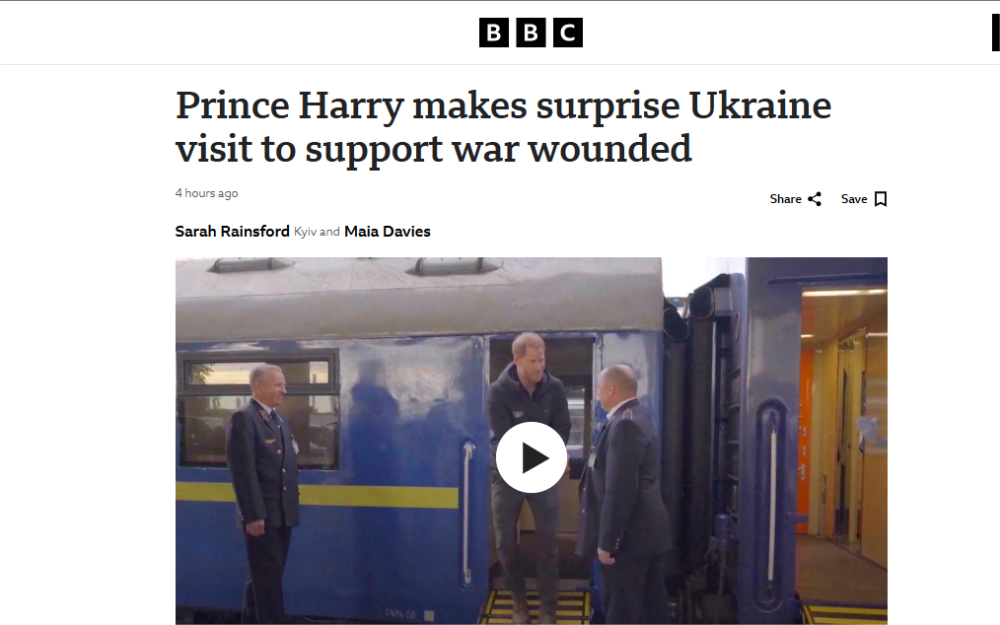

# News-API-App-Python-tkinter-GUI-Project

  <!-- Python -->
  

A simple **Python News App** built using the `tkinter` GUI module.  
It fetches **real-time news** from an API (e.g., [NewsAPI.org](https://newsapi.org/)) using the `requests` module and displays them with images, headlines, and descriptions.  
Users can navigate between news articles and read full news in a web browser.
 ## ✔️TABLE OF CONTENTS
- [News-API-App-Python-tkinter-GUI-Project](#news-api-app-python-tkinter-gui-project)
  - [✔️TABLE OF CONTENTS](#️table-of-contents)
  - [📂 Project Structure](#-project-structure)
  - [📸 Photos](#-photos)
  - [✨ Features](#-features)
  - [🛠️ Tech Stack](#️-tech-stack)
  - [🚀 Future Improvements](#-future-improvements)
  - [🙏 Acknowledgements](#-acknowledgements)
  - [👨‍💻Author](#author)

## 📂 Project Structure
NewsApp/
│
├── news_app.py # Main application file
├── README.md # Project documentation
└── Screenshot of NEWS APP #GUI of APP

## 📸 Photos
- 
- 
- 
- 
- 

## ✨ Features
- 📡 Fetches **live news** using API calls.  
- 🖼️ Displays **news images, headlines, and descriptions**.  
- ⬅️➡️ Easy navigation using **Prev / Next / READ MORE** buttons.  
- 🌐 "Read More" button opens the full article in your default browser."Prev" button is used to move backward in the app.Next button is used to preview forward in the app depending upon the news articles. 
- 🖥️ Built with **Tkinter GUI** for a lightweight desktop app experience.  

## 🛠️ Tech Stack
- **Python**
- **Tkinter** → GUI framework  
- **Requests** → API calls  
- **PIL (Pillow)** → Image processing  
- **Webbrowser** → Open articles in browser  
- **OOPS** → For writing the functions
--- 

## 🚀 Future Improvements

🔍 Add category-based filtering (business, sports, tech, etc.)

🌍 Support for multiple countries/languages

🌓 Dark mode UI

## 🙏 Acknowledgements
🔴 Special thanks to [NewsAPI.org](https://newsapi.org/) for providing the news data API.  
✔️ This project wouldn’t be possible without their awesome service.

 ## 👨‍💻Author
Aman kumar
[GitHub](https://github.com/Aman-coder2004)
